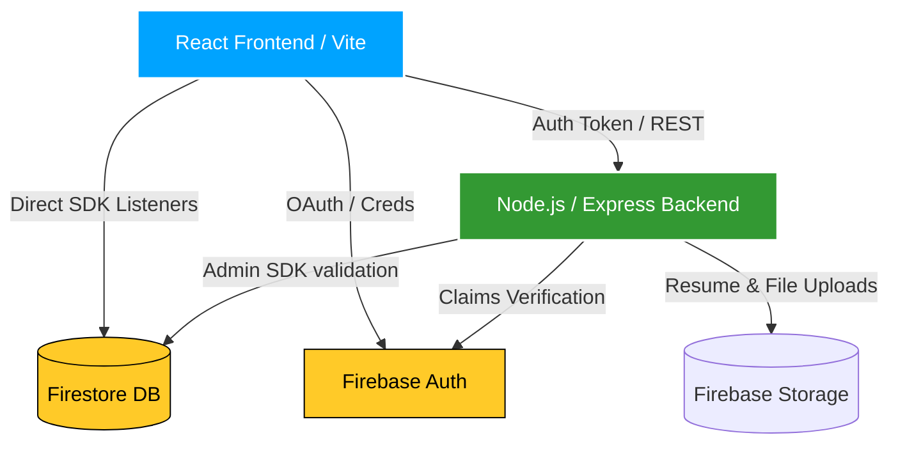

# 🎓 PlaceCloud — Cloud-Based Placement Management System

<div align="center">


A full-stack, production-ready campus placement management platform built with **React**, **Node.js**, **Firebase**, and **Tailwind CSS**. Designed to bridge the gap between Students, Recruiter Organizations, and Placement Officers.

[Explore Setup](#-quick-start-local-development) • [API Documentation](#-api-reference) • [Architecture](#%EF%B8%8F-system-architecture) • [CLI Scripts](#%EF%B8%8F-cli-scripts--data-management)

</div>

---

## 📖 Table of Contents
- [✨ Key Features](#-key-features)
- [🏗️ System Architecture](#%EF%B8%8F-system-architecture)
- [📁 Project Structure](#-project-structure)
- [🚀 Quick Start (Local Development)](#-quick-start-local-development)
- [🔥 Firebase Config & Seeding](#-firebase-config--seeding)
- [🛠️ CLI Scripts & Data Management](#%EF%B8%8F-cli-scripts--data-management)
- [🔐 Google SSO & Security](#-google-sso--security)
- [☁️ Cloud Deployment](#%EF%B8%8F-cloud-deployment)
- [🌐 API Reference](#-api-reference)
- [🗃️ Firestore Collections Schema](#%EF%B8%8F-firestore-collections-schema)
- [🎨 Design System](#-design-system)

---

## ✨ Key Features

### 👥 Role-Based Portals & Dashboards
| Portal Role | Key Capabilities |
| :--- | :--- |
| **🎓 Student** | Resume upload, profile builder, filtered job application feed, application timeline tracker. |
| **💼 Recruiter** | Job posting and management, candidate matching (CGPA, branch, skills), resume downloads. |
| **🛡️ Placement Officer (Admin)** | Student & recruiter approvals, bulk data imports, exportable reports (Excel/PDF), and stats charts. |
| **👩‍🏫 Faculty Coordinator** | Department-level student performance analytics, CGPA distribution charts, validation tools. |

### ⚡ Platform Highlights
- **Real-Time Database Sync**: Live Firestore listeners trigger instant dashboard state changes without page reloads.
- **Robust Authentication**: Firebase Authentication supports email/password credentials and Google OAuth (SSO) with custom claims.
- **Reporting Engine**: Dynamic charts using **Recharts**, bulk Excel/CSV import/export via **SheetJS**, and PDF generation with **jsPDF**.
- **Interactive UI**: Futuristic glassmorphism theme using **Framer Motion** animations.

---

## 🏗️ System Architecture



---

## 📁 Project Structure

<details>
<summary>📂 <b>View Directory Map</b> <i>(Click to expand)</i></summary>

```
placement-system/
├── frontend/                 # Vite + React + Tailwind
│   ├── src/
│   │   ├── components/       # Common layouts & visual elements
│   │   ├── pages/            # View pages (admin, student, recruiter, faculty)
│   │   ├── context/          # Global AuthContext & hooks
│   │   └── services/         # API (Axios instance) & Firebase configuration
│   └── package.json
│
├── backend/                  # Node.js + Express Rest API
│   ├── routes/               # API Router endpoints
│   ├── middleware/            # Auth claims & JWT interceptors
│   ├── config/               # Firebase Admin SDK setups
│   ├── scripts/              # Migration, backfill, and database seeds
│   └── server.js             # Main API entrypoint
│
├── firestore.rules            # Firestore security rules
├── firestore.indexes.json     # Composite database indexes
├── firebase.json              # Hosting & Cloud Run proxy setups
├── docker-compose.yml         # Local Docker setup
├── .github/workflows/         # Deployment CI/CD configurations
└── README.md
```
</details>

---

## 🚀 Quick Start (Local Development)

### 📋 Prerequisites
- **Node.js 18+** installed.
- A **Firebase Project** set up ([Firebase Console](https://console.firebase.google.com)).

### 1. Clone the repository
```bash
git clone https://github.com/raushankumar61/placement-data-management-system.git
cd placement-system
```

### 2. Configure Environment Variables
- **Frontend Setup**: Copy the example configuration and input your Firebase app keys:
  ```bash
  cp frontend/.env.example frontend/.env.local
  ```
- **Backend Setup**: Copy the example configuration and insert your Firebase Admin credentials:
  ```bash
  cp backend/.env.example backend/.env
  ```

### 3. Install All Dependencies
Install dependencies for both frontend and backend directories concurrently from the project root:
```bash
npm run install:all
```

### 4. Run Development Servers
Start the full-stack system concurrently (Frontend on `:3000`, Backend on `:5000`):
```bash
npm run dev
```

> [!NOTE]
> You can also run the servers individually using `npm run dev:frontend` or `npm run dev:backend` from the root workspace.

---

## 🔥 Firebase Config & Seeding

### Step 1 — Enable Firebase Services
1. Activate **Authentication** (Email/Password + Google Provider).
2. Activate **Firestore Database** (Start in production mode).
3. Activate **Cloud Storage** for resume file hosting.

### Step 2 — Link Credentials
- **Frontend configuration**: Copy the Web Client configuration dictionary from Firebase app settings to `frontend/.env.local`.
- **Backend credentials**: Download a new Firebase Admin SDK private key JSON from *Project Settings → Service Accounts*, and format it as a single string variable inside `backend/.env`:
  ```bash
  FIREBASE_SERVICE_ACCOUNT_JSON='{"type":"service_account","project_id":"..."}'
  ```

### Step 3 — Deploy Security Rules & Indexes
Deploy database structures to Firestore using `firebase-tools`:
```bash
npm install -g firebase-tools
firebase login
firebase use YOUR_PROJECT_ID
firebase deploy --only firestore:rules,firestore:indexes
```

---

## 🛠️ CLI Scripts & Data Management

The backend contains utility scripts for database migrations, backfills, and database seeding. Execute these scripts using `npm run <script-name>` from the `backend/` directory:

| Script Command | Script File | Description |
| :--- | :--- | :--- |
| `npm run seed:students` | `scripts/seedStudents.js` | Generates 200 mock student profiles in Firestore. |
| `npm run seed:marketplace` | `scripts/seedMarketplaceData.js` | Seeds jobs, recruiters, and placement applications. |
| `npm run backfill:students` | `scripts/backfillStudentData.js` | Migrates legacy student profiles to include new system default fields. |
| `npm run backfill:marketplace` | `scripts/backfillMarketplaceData.js`| Recomputes aggregates, metrics, and recruiters statistics. |
| `npm run backfill:job-deadlines`| `scripts/refreshJobDeadlines.js` | Extends expirations and refreshes job posting deadlines. |
| `npm run backup:firestore` | `scripts/exportFirestoreBackup.js` | Backs up all collection documents to a timestamped folder. |
| `npm run restore:firestore` | `scripts/restoreFirestoreBackup.js` | Restores Firestore collection structures from a local backup source. |

---

## 🔐 Google SSO & Security

### 🤝 Google Sign-In Department Syncer
The custom Google SSO registration flow requires registering users to provide their metadata at checkout:
1. **Department selection**: On signup, users choosing Google Sign-In must provide their role (`student` or `faculty`) and select their **Department/Branch**.
2. **Claims Synchronization**: Express claims middleware validates the Firebase JWT, sets role custom claims, and registers profiles under `users/{uid}` in Firestore.
3. **Student Profile Initialization**: If the user registers as a student, a Firestore document in `students/{uid}` is automatically initialized with the selected department configured as their academic `branch`.

---

## ☁️ Cloud Deployment

<details>
<summary>🚀 <b>Option A: Firebase Hosting + Cloud Run (Recommended)</b></summary>

#### 1. Deploy the Backend REST API
Compile and build the API container to Google Artifact Registry and run on Google Cloud Run:
```bash
cd backend
gcloud builds submit --tag gcr.io/YOUR_PROJECT_ID/placement-backend
gcloud run deploy placement-backend \
  --image gcr.io/YOUR_PROJECT_ID/placement-backend \
  --platform managed \
  --region us-central1 \
  --allow-unauthenticated \
  --set-env-vars "NODE_ENV=production,FIREBASE_PROJECT_ID=YOUR_PROJECT_ID,FIREBASE_SERVICE_ACCOUNT_JSON=..."
```

#### 2. Deploy the Frontend client
Build and push assets to Firebase Global CDN:
```bash
cd frontend
npm run build
firebase deploy --only hosting
```
</details>

<details>
<summary>☁️ <b>Option B: Deploy to Render</b></summary>

1. Connect your Github repository to [Render](https://render.com).
2. **Backend Config**: Create a Web Service:
   - Root Directory: `backend`
   - Build Command: `npm install`
   - Start Command: `node server.js`
   - Setup environment variables in the Render console.
3. **Frontend Config**: Create a Static Site:
   - Root Directory: `frontend`
   - Build Command: `npm run build`
   - Publish Directory: `dist`
</details>

<details>
<summary>🐳 <b>Option C: Self-Hosted Docker Compose</b></summary>

Build and launch the complete multi-container system locally using Docker:
```bash
docker-compose up --build
```
</details>

---

## 🌐 API Reference

> [!IMPORTANT]
> All REST API endpoints require a valid Authorization Bearer header: `Authorization: Bearer <Firebase_ID_Token>`.

<details>
<summary>🔍 <b>Expand Full Endpoint Catalog</b> <i>(Click to expand)</i></summary>

### 🔑 Authentication
* **POST** `/api/v1/auth/verify-token`
  - *Description*: Validates the Firebase user ID token and returns the profile details.
  - *Access*: All Roles.

### 🎓 Students Management
* **GET** `/api/v1/students`
  - *Description*: Returns all student records.
  - *Access*: Admin, Faculty.
* **POST** `/api/v1/students`
  - *Description*: Creates a new student record manually.
  - *Access*: Admin.
* **PUT** `/api/v1/students/:id`
  - *Description*: Modifies details of a specific student profile.
  - *Access*: Admin, Student owner.
* **DELETE** `/api/v1/students/:id`
  - *Description*: Removes a student record.
  - *Access*: Admin.
* **POST** `/api/v1/students/bulk-import`
  - *Description*: Imports student records from a Excel/CSV spreadsheet.
  - *Access*: Admin.

### 💼 Jobs & Applications
* **GET** `/api/v1/jobs`
  - *Description*: Fetches all job postings.
  - *Access*: All Roles.
* **POST** `/api/v1/jobs`
  - *Description*: Posts a new vacancy.
  - *Access*: Admin, Recruiter.
* **GET** `/api/v1/applications`
  - *Description*: Fetches job application submissions.
  - *Access*: Admin, Faculty, Recruiter.
* **POST** `/api/v1/applications`
  - *Description*: Submits a student job application.
  - *Access*: Student.
* **PUT** `/api/v1/applications/:id/status`
  - *Description*: Updates an application status (e.g., Shortlisted, Selected).
  - *Access*: Admin, Recruiter.

### 📊 Reports & Notifications
* **GET** `/api/v1/reports/placement`
  - *Description*: Fetches statistics and summary graphs on placements.
  - *Access*: Admin, Faculty.
* **POST** `/api/v1/notifications/send`
  - *Description*: Dispatches push alerts to specific target roles.
  - *Access*: Admin.
</details>

---

## 🗃️ Firestore Collections Schema

<details>
<summary>📂 <b>Expand Document Models</b></summary>

```typescript
users/{uid} {
  name: string;
  email: string;
  role: 'admin' | 'student' | 'recruiter' | 'faculty';
  department: string;
  createdAt: timestamp;
}

students/{uid} {
  cgpa: string;
  branch: string;
  skills: string[];
  resumeURL: string;
  placementStatus: 'placed' | 'in-process' | 'unplaced';
  projects: { title: string; description: string }[];
}

jobs/{jobId} {
  title: string;
  company: string;
  eligibility: { minCGPA: number; branches: string[] };
  deadline: string;
  postedBy: string;
  status: 'active' | 'closed';
}

applications/{appId} {
  studentId: string;
  jobId: string;
  status: 'Applied' | 'Shortlisted' | 'Selected' | 'Rejected';
  appliedAt: timestamp;
}
```
</details>

---

## 🎨 Design System

- **Typography**: `Syne` (for major page headings) + `DM Sans` (for readable body layout).
- **Core Palette**:
  - Primary Accent: `#00A3FF` (Electric Sky Blue)
  - Contrast Highlight: `#F5A623` (Premium Amber Gold)
  - Background Canvas: `#050811` (Deep Space Blue)
- **Styling Paradigm**: Framer Motion glassmorphism panels configured with `backdrop-blur-md` and semi-transparent borders.

---

## 📜 License

Project distributed under the **MIT License**.  
© 2026 PlaceCloud. Developed for DSCE Placement Officer Department.
